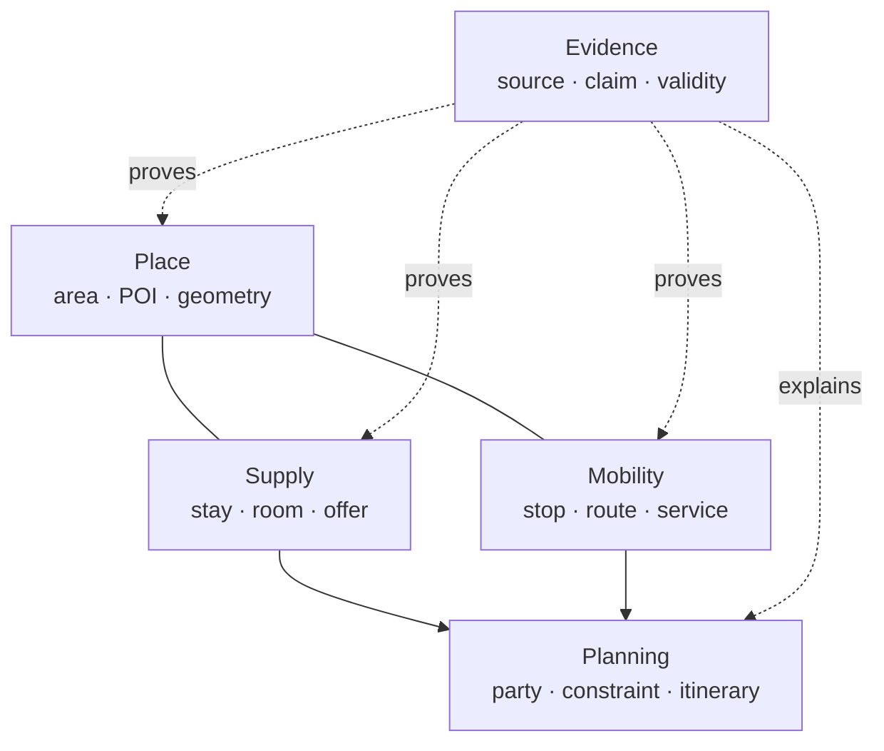

# General travel ontology

Wayweave uses a pragmatic ontology: the vocabulary is rich enough to join travel data, but maps cleanly to relational tables and UI decisions. It does not require an RDF store for normal product queries.

## 1. Place

`Place` is the shared geographic anchor. Countries, administrative areas, cities, neighborhoods, transport stops, accommodations, restaurants, attractions and natural features are specializations. A record may have a point, boundary, parent place and typed relations to other places.

Mappings: `schema:Place`, `schema:TouristDestination`, `schema:TouristAttraction`, GeoSPARQL geometry concepts.

## 2. Supply

Supply separates the thing from its commercial state:

- `Accommodation` describes the property.
- `Room` describes capacity, beds and views.
- `Amenity` is reusable and typed.
- `Offer` describes a sellable option for a party size and validity window.
- `AvailabilitySnapshot` records volatile price and inventory observations without overwriting history.

Mappings: `schema:LodgingBusiness`, `schema:HotelRoom`, `schema:Offer`, `schema:LocationFeatureSpecification`.

## 3. Mobility

Mobility follows the shape of GTFS: `Operator → Route → Service → ScheduledCall → Stop`. Internal UUIDs stay stable while `SourceRecord` keeps each feed's original identifiers. Reservation deadlines and pickup rules are modeled explicitly because rural and island transport often depends on them.

Mappings: GTFS `agency`, `route`, `trip`, `stop_time`, `stop`, `calendar`, `calendar_dates`.

## 4. Planning

Planning distinguishes user intent from a computed itinerary:

- `Trip` owns dates, party and status.
- `Preference` is a weighted desire such as sea view or quietness.
- `Constraint` is a hard or soft rule such as no car, solo room or maximum transfer risk.
- `ItineraryItem` is a time-bounded transport, stay, activity, meal or buffer.
- `ConstraintEvaluation` stores pass/warn/fail plus a human-readable explanation and evidence.

This last entity is what lets the UI say *why* an option is risky instead of showing an unexplained score.

## 5. Evidence

Every volatile or externally asserted fact can be represented as a `Claim` linked to a `SourceRecord` and `Source`. Keep these times separate:

- `retrieved_at`: when the system fetched it.
- `observed_at`: when the publisher observed it.
- `valid_during`: when the fact is applicable.
- `asserted_at`: when Wayweave accepted the normalized claim.

Mappings: PROV-O `Entity`, `Activity`, `Agent`, `wasDerivedFrom`; OWL-Time intervals.

## Identity and deduplication

Never use a provider ID as the canonical ID. Match records in layers: exact trusted crosswalk, normalized coordinates and names, then scored candidates requiring review. Preserve all provider IDs in `SourceRecord` so imports are idempotent and reversible.

## Storage boundaries

PostgreSQL/PostGIS is the operational source of truth. Use JSONB only for low-frequency extensions and raw source payloads. Export denormalized Parquet for analytical scans or bulk distribution; use a search engine only after PostgreSQL full-text and trigram search become the measured bottleneck.
